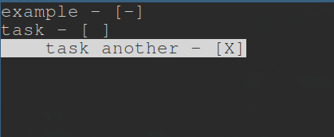

# C-TODO
C-TODO is a blazingly fast, TODO list written in C++, supporting multi-level headers. 
Every header has three levels of completion - [ ], [-] and [X]. There is normal mode, 
that listens to commands and edit mode, that lets you freerly edit every header.


## Installation
Easiest way to install the project is to copy the repo
```
git clone https://github.com/Michal-Swi/C-TODO
cd C-TODO
sudo make install
```
```
git clone https://github.com/Michal-Swi/C-TODO && cd C-TODO && sudo make install
```
## Usage
Every command besides the delete one, works like this, the code waits for a key
to be pressed, if the key is a command, the code waits in the command function 
for specification key. 

### Add New Header Command
To add a new header, you press
```
a
```
and then the specification:
```
h (adds header "here", the same level as current header)
```
```
a ("above" the current header)
```
```
b ("below" the current header)
```

### Change completion level
```
c (the general keybind)
```
```
u (ups the completion level)
```
```
d (decreases the completion level)
```

### Delete Header
```
d (deletes the header and all of its children)
```

### Exiting
```
e (to exit)
```
```
s (with saving)
```
```
! (without saving)
```

### Edit mode
You can switch between edit and normal mode, with
```
:
```
when in normal mode you delete every character from a header, you completly delete it
and all of its children, it's not a bug it's a feature. 

## Config
The libary I used to parse .toml files - [here](https://marzer.github.io/tomlplusplus/)
The make install command sould create the config file in ~/.config/C-TODO/config.toml
That's where the code looks for the config.

If you want to change one of the commands keybind you just use this:
```
AddNewHeaderCommand = "f"
```
this will add a keybind for AddNewHeaderCommand, not replace it.
If you make "f" a string, the code won't work.

If you want to change the specification key, you make a label, and change the keys there:
```
[AddNewHeader]
up = "g"
```
Unlike the normal command keys, making config for the specification keys, overwrites them.

## For forkers
Don't.
