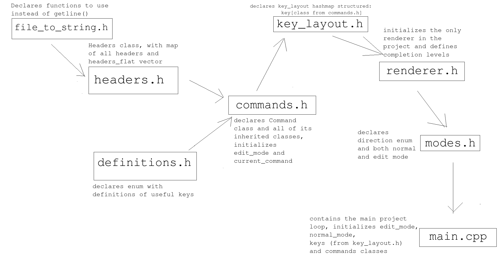

# C-TODO
C-TODO is a TODO list written in C++, supporting multi-level headers and soon 
bash commands, that are supposed to make it easier to use. Every header supports 
three levels of completion - [ ], [-] and [X]. There is normal mode, that listens
to commands and edit mode, that lets you freerly edit every header.


## Installation
Easiest way to install the project is to copy the repo
```
git clone https://github.com/Michal-Swi/C-TODO
```
and then just 
```
./TODO
```
or 
```
make
```

## Usage
Every command besides the delete one, works like this, the code waits for a key
to be pressed, if the key is a command, the code waits in the command function 
for more specification on what do you want to do. Right now one can only config
the first keys meaning the general keys. 

### Add New Header Command
To add a new header, you press
```
a
```
and then the specification:
```
h (adds header "here", the same level as current header)
```
```
a ("above" the current header)
```
```
b ("below" the current header)
```

### Change completion level
```
c (the general keybind)
```
```
u (ups the completion level)
```
```
d (decreases the completion level)
```

### Delete Header
```
d (deletes the header and all of its children)
```

### Exiting
```
e (to exit)
```
```
s (with saving)
```
```
! (without saving)
```

### Edit mode
You can switch between edit and normal mode, with
```
:
```
when in normal mode you delete every character from a header, you completly delete it
and all of its children, it's not a bug it's a feature. 

## Config
The libary I used to parse .toml files - [here](https://marzer.github.io/tomlplusplus/)
Make a config file in ~/.config/C-TODO/config.toml and edit like this
```
AddNewHeaderCommand = "f"
```
this will add a keybind for AddNewHeaderCommand, not replace it.
If you make "f" a string, the code won't work.

## For forkers
Better docs soon, right now it's just the project "blueprint" 

